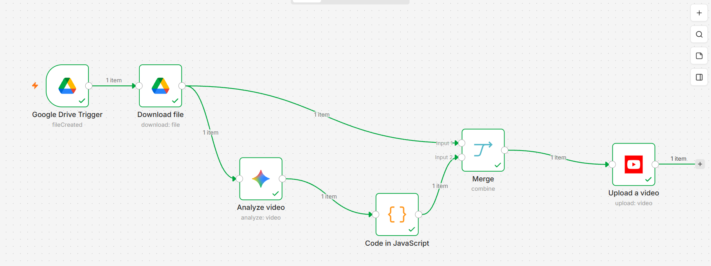

# AI-Powered Automatic Video Publisher with n8n

An end-to-end n8n automation that automatically processes existing videos, analyzes their content with Google Gemini AI, generates publishing metadata, and uploads them to YouTube.

## 🚀 Overview

This project automates the repetitive process of publishing multiple existing videos.

Instead of manually analyzing each video, creating a title, writing a description, generating hashtags, and uploading the video to YouTube, the workflow handles the process automatically.

## 🏗️ Workflow Architecture

### Automation Flow

Google Drive Trigger  
↓  
Download File  
↓  
Google Gemini – Analyze Video  
↓  
JavaScript – Process AI Response  
↓  
Merge Video + Metadata  
↓  
YouTube – Upload Video

The original video file is preserved while Google Gemini analyzes its content.

The AI-generated metadata is processed with JavaScript and then merged with the original video before the final upload to YouTube.

## ⚙️ How It Works

1. A new video is added to a monitored Google Drive folder.
2. Google Drive Trigger detects the new file.
3. n8n downloads the video automatically.
4. Google Gemini analyzes the video content.
5. AI generates relevant publishing metadata:
   - Video title
   - Description
   - Hashtags
6. JavaScript processes the AI response.
7. The Merge node combines the original video with the generated metadata.
8. The completed video is automatically uploaded to YouTube.

## 🛠️ Technologies

- n8n
- Google Drive
- Google Gemini AI
- YouTube
- JavaScript
- Google APIs
- OAuth

## 🎯 Problem Solved

Publishing multiple videos manually requires repetitive work.

For every video, a content creator may need to:

- Retrieve the video
- Analyze its content
- Create a title
- Write a description
- Select relevant hashtags
- Upload the video
- Configure the publication

This automation reduces those repetitive manual steps and creates a scalable publishing workflow.

## 💼 Use Cases

This workflow can be useful for:

- Content creators
- YouTube channel managers
- Marketing teams
- Social media teams
- Agencies
- Businesses managing large video libraries

## 🔐 Security

No API keys, access tokens, OAuth credentials, passwords, or other sensitive information are publicly included in this repository.

The complete production workflow JSON is not publicly distributed.

## 📊 Project Status

- ✅ Google Drive monitoring
- ✅ Automatic video download
- ✅ AI video analysis
- ✅ AI-generated metadata
- ✅ JavaScript data processing
- ✅ Video and metadata merging
- ✅ Automatic YouTube upload
- ✅ End-to-end workflow tested

## 👩‍💻 Author

**Esther Madianga**

Freelance Automation Specialist | n8n & AI Automation
